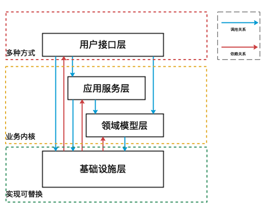
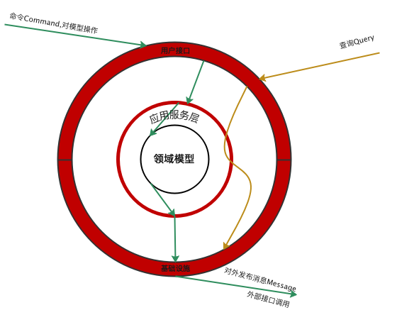
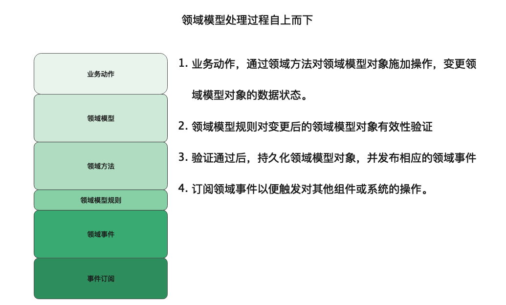

# 领域驱动开发建模核心库
[](https://gitee.com/lixiaojing/easy-domain/stargazers)
> 在领域驱动设计中，包括了领域实体、聚合根、值对象、领域规则、实体操作、领域服务以及领域事件等概念，当业务需求分析完成后，将基于以上概念对业务进行表达，领域驱动开发建模核心库包括了用于支持这些概念表达基础类库。

## Maven依赖

编辑您的pom.xml文件

```xml

<profiles>
    <profile>
        <id>coding</id>
        <repositories>
            <repository>
                <id>leebmw-easy-snapshoot</id>
                <name>snapshoot</name>
                <url>https://leebmw-maven.pkg.coding.net/repository/easy/snapshoot/</url>
                <releases>
                    <enabled>true</enabled>
                </releases>
                <snapshots>
                    <enabled>true</enabled>
                </snapshots>
            </repository>
        </repositories>
    </profile>
</profiles>
```

```xml

<dependency>
    <groupId>easy.ddd.domain</groupId>
    <artifactId>easy-domain</artifactId>
    <version>1.2</version>
</dependency>
```


## 版本日志

### 计划实现的特性

1. 增强实体基础类的功能，可以收集事件、操作记录集合
2. 事件订阅支持通用订阅能力，例如所有事件都会触发的操作
3. 增加事件定义分组的功能，满足在不同场景下，执行不同订阅分组分组的能力

### 1.3版本新增特性

1. 增加ICustomValidate接口，通过该接口以实现实体验证规则，通过入参动态传入
2. 增加 IDataRoot、IValueObjectRoot 语义接口定义
3. 事件订阅支持按指定的依赖顺序先后执行。

## 使用文档

### 实体

根据领域驱动设计中实体的定义，一个实体是一个唯一的东西，每一个实体都有一个唯一的业务身份标识，并且实体具有生命周期，在生命周期内实体的状态会不断发生变化。实体对象的每一次变化都需要使用业务规则进行验证，以保证实体状态的变更是合法有效的。

实体的通用基类 EntityBase 和 ConcurrentEntityBase。

#### 实体对象定义

```java
class Order extends EntityBase<Long> {
    
    @Override
    public Boolean validate() {
        return null;
    }

    @Override
    protected BrokenRuleMessage getBrokenRuleMessages() {
        return null;
    }
}
```


#### 具有并发能力（乐观锁）的实体对象定义

```java
class Order extends ConcurrentEntityBase<Long> {

    @Override
    public Boolean validate() {
        return null;
    }

    public BrokenRuleMessage getBrokenRuleMessages() {
        return null;
    }
}
```

#### 支持自定以业务规则类传入的实体定义

```java
import easy.domain.base.ICustomValidator;

class Order extends EntityBase<Long> implements ICustomValidator<Order>{

    // 无法动态传入验证规则类的验证方法
    @Override
    public Boolean validate() {
        return new OrderEntityRule().isSatisfy(this);
    }

    @Override
    protected BrokenRuleMessage getBrokenRuleMessages() {
        return new OrderBrokenRuleMessages();
    }
    // 支持自定义传入验证规则类的方法
    @Override
    public Boolean validate(EntityRule<Order> rule) {
        return  rule.isSatisfy(this);
    }
}
```

1. 实体类型定义继承自 EntityBase&lt;T> 或 ConcurrentEntityBase&lt;T>，泛型 T 表示实体类唯一业务标识类型，可以是基础类型、也可以是复杂类型
2. 继承EntityBase的实体类，需要实现 validate() 和 getBrokenRuleMessages() 抽象方法，validate()方法用于对实体对象进行业务规则验证、getBrokenRuleMessages()
   方法用于定义异常业务规则描述信息
3. ConcurrentEntityBase&lt;T>类继承自EntityBase&lt;T>
   ,多出用于进行并发控制的版本号version和oldVersion字段，version是实体对象本次状态变更的最新版本号，oldVersion是实体对象最后一次变更的版本号，最终实现并发控制还需要数据库乐观锁能力一起配合。
4. 1.3版本新增ICustomValidator验证接口，用于当实体规则类需要从外部传入的情况。

### 实体业务规则

实体具有唯一的身份标识，在生命周期内实体的状态会不断发生变化，实体业务规则类，负责保证在实体对象状态变化的过程中实体数据合法有效，当有异常数据时，能够反馈出异常数据的描述或具体异常字段信息等。

业务规则类的基类 EntityRule

#### 实体业务规则类

```java
class OrderEntityRule extends EntityRule<Order> {
    // 1 
    public OrderEntityRule() {
        // 2
        this.isBlank("pin", OrderBrokenRuleMessages.PIN_IS_EMPTY, "");

        // 3
        this.addRule("totalPrice", new IRule<Order>() {
            @Override
            public boolean isSatisfy(Order model) {
                return model.getTotalPrice().compareTo(BigDecimal.ZERO) > 0;
            }
        }, OrderBrokenRuleMessages.TOTAL_PRICE_ERROR, "");

        // 4
        this.addRule(new IRule<Order>() {
            @Override
            public boolean isSatisfy(Order model) {
                // 4.1
                return model.getOrderItemList().size() > 0 && model.getOrderItemList().size() < 100;
            }
        }, OrderBrokenRuleMessages.ORDER_ITEM_ERROR, "", new IActiveRuleCondition<Order>() {
            // 4.2
            @Override
            public boolean isActive(Order model) {
                return model.getStatus() == 1;
            }
        });
    }
}

```

1. 实体业务规则定义类继承自EntityRule&lt;T>类，实体业务规则的类名一般按 "<实体名>EntityRule" 来命名，泛型T是要验证得实体类型。
2. 实体业务规则初始化在类的构造函数中完成，上面例子中的1处示例，可以根据实际情况将规则代码拆分组织，在构造函数中完成最终组装。
3. EntityRule基类提供了几种方式实现业务规则验证，基础的验证规则包含以下几种实现 isBlank()、email()、numberShouldGreaterThan()、numberShouldLessThan()
   、dateShouldGreaterThan()、dateShouldLessThan()、booleanShouldEqual()、numberShouldEqual() 上面例子中的2处，是一个简单的例子。
4. EntityRule还提供了两更具灵活性的业务规则验证方法 addRule()、addParamRule()，上面4处示例展示了 addRule() 方法的使用。
5. addRule的第一个参数是实现了IRule接口的匿名类，isSatisfy方法实现具体的业务规则验证，验证完成后返回true或false,true表示业务规则验证通过，false表示不通过；方法入参是业务实体对象,如上示例4.1。
6. addRule最后一个参数，是实现了IActiveRuleCondition接口匿名类，该接口用于控制业务规则参与验证的条件，当不满足条件时，直接忽略该业务规则
   ，isActive方法实现具体控制规则，返回true表示业务规则生效参与验证、false表示不参与验证。如果使用addRule的重载版本，不传递IActiveRuleCondition实现，则默认该业务规则总是参与验证。
7. addParamRule()方法和addRule()功能类似，前者支持参数化异常消息处理。

#### 实体业务规则异常描述类

```java
// 5
class OrderBrokenRuleMessages extends BrokenRuleMessage {
    // 5.1
    public static final String PIN_IS_EMPTY = "PIN_IS_EMPTY";
    public static final String TOTAL_PRICE_ERROR = "TOTAL_PRICE_ERROR";
    public static final String ORDER_ITEM_ERROR = "ORDER_ITEM_ERROR";

    @Override
    protected void populateMessage() {
        // 5.2
        this.getMessages().put(PIN_IS_EMPTY, "用户PIN不能为空");
        this.getMessages().put(TOTAL_PRICE_ERROR, "订单总金额不能为0");
        this.getMessages().put(ORDER_ITEM_ERROR, "订单商品不能为0且商品数超过100");

    }
}
```

1. 实体业务规则异常描述类用于统一放置实体的异常规则描述，该类的命名规则一般按"<实体名>BrokenRuleMessages"。
2. 该类统一继承自抽象类 BrokenRuleMessage 并需要实现 populateMessage() 抽象方法
3. 以上示例中 5.1 展示了异常KEY定义的方式，5.2 展示了异常KEY对应文字描述信息的书写方式

#### 实体业务规则验证的使用方式

```java
class Order extends EntityBase<Long> {

    // 1
    @Override
    public Boolean validate() {
        // 1.1
        return new OrderEntityRule().isSatisfy(this);
    }

    // 2
    @Override
    protected BrokenRuleMessage getBrokenRuleMessages() {
        // 2.2
        return new OrderBrokenRuleMessages();
    }
}
```

1. 实体业务规则验证，需要和实体配合一块使用，以实体为中心展开验证，一般一个实体只对应一个实体业务规则EntityRule
2. 在实体类中重写validate()方法，如以上示例中 1.1显示，也可以自行写一个validate()的重载，以便实现更加灵活的EntityRule类管理。
3. 实体也可以实现ICustomValidator接口，以便能够动态传入EntityRule验证规则类。

4. 在实体类中，还需要重写getBrokenRuleMessages(),直接返回实体业务规则异常描述类的一个实例，如以上的
   2.2，一般情况下，实体业务规则异常描述类，是线程安全的，因此，也可以定义单例模式，在getBrokenRuleMessages()方法中返回单例对象。

```java
public class MainTestClass {
    @Test
    public void orderTest() {
        // 3
        Order order = new Order();
        // 4
        Boolean validate = order.validate();

        if (!validate) {
            // 5
            order.getBrokenRules();
            // 6
            order.aggregateExceptionCause();
            // 7
            order.throwBrokeRuleAggregateException();
            // 8
            order.exceptionCause();
            // 9
            order.throwBrokenRuleException();

        }
    }
}

```

1. 以上单元测试代码，示例的是对Order对象进行业务规则验证过程，3 处实例化一个Order对象，4 处调用实体对象的validate()方法.
2. validate()方法，返回一个Boolean结果，true表示验证通过，false表示验证失败
3. 示例中5、6、7、8、9处展示了各种用于获取异常信息的处理方式，
    * getBrokenRules() 方法获取所有异常信息列表
    * aggregateExceptionCause()以BrokeRuleAggregateException的形式返回所有异常信息，
    * throwBrokeRuleAggregateException() 方法直接throw出BrokeRuleAggregateException
    * exceptionCause() 返回所有异常中的第一个，类型是BrokenRuleException
    * throwBrokenRuleException() 直接throw出所有异常中的第一个，类型是BrokenRuleException

### 领域事件

在领域驱动设计中，领域事件是对实体对象，由于某一业务操作导致实体对象状态发生变化的事实的描述。例如，当订单实体调用支付payment()
方法后，订单的状态变成已支付，并产生订单已支付的事件，该事件将交由应用服务层去发布，相关业务组件将会订阅订单已支付事件、并对事件做出相关的响应。

#### 领域事件定义

```java

@EventName(value = "OrderPayedEvent", shareTopicName = "")
class OrderPayedEvent extends BaseDomainEvent {

    //还可以有其他的字段

    public OrderPayedEvent(long orderId) {

        this.setBusinessId(String.valueOf(orderId));
    }

}

```

1. 领域事件统一继承自BaseDomainEvent类，该类有 businessId 字段，值一般是发生事件的业务对象标识，事件子类还可以有其他相关的字段，以便其他业务组件能够根据事件信息做出不同的处理逻辑。
2. 领域事件一般描述的是已发生业务操作的实事，所以在类命名上采用过去式的方式 "<实体名><业务操作过去式表达>Event" ，如上例中的订单已支付事件OrderPayedEvent
3. 领域事件上的注解@EventName是可选项，用于和其它发布事件的基础设施进行交互。shareTopicName 可以用于基础设施底层共享的事件发布通道命名 例如，Kafka中的Topic,可以被多个领域事件对象共享。

#### 领域事件使用

```java
class Order extends EntityBase<Long> {

    private BigDecimal totalPrice = BigDecimal.ZERO;
    private String comment = "";
    private String pin;
    private int status;

    private List<OrderItem> orderItemList;

    @Override
    public Boolean validate() {
        return new OrderEntityRule().isSatisfy(this);
    }

    @Override
    protected BrokenRuleMessage getBrokenRuleMessages() {
        return new OrderBrokenRuleMessages();
    }

    /**
     * 订单支付业务操作
     *
     * @return 返回订单已支持事件
     */
    public OrderPayedEvent payment() {
        this.status = 3;
        return new OrderPayedEvent(this.getId());
    }
}
```

1. 领域事件需要结合实体业务操作方法一起使用，实体上的业务操作方法在操作完成后，返回对应的事件对象，如果操作失败，返NULL，表示没有事件发生。

### 应用服务层

应用服务层，在领域驱动设计分层架构中的角色是用于实现协作、统筹和编排领域模型以及基础设施层的各种业务组件类，以实现相关业务功能。此外，对实体对象的各种操作，都必须经由应用服务层处理，任何其它地方都不能私自处理。应用服务层，也是用于保证实体对象逻辑一致性（强一致，一般指数据库事务）和发布实体对象生成的领域事件的地方。

应用服务层是极容易出现代码坏味道的地方，应用服务层是协作者，不是业务决策者。在该层出现业务决策类的代码段时，需要格外注意。

通过将业务决策代码放回到领域层以及通过发布订阅模式将各业务组件进行解耦，可以使该层清晰职责和结构。

#### 实体操作应用服务类定义

```java
// 1
class OrderApplicationService extends BaseApplication {

    private IOrderRepository orderRepository;

    // 2
    public OrderApplicationService() {
        this.initSubscriber();
    }

    public void payment(long orderId) {
        // 3
        Order order = this.orderRepository.findByOrderId(orderId);
        if (order != null) {
            // 4
            OrderPayedEvent orderPayedEvent = order.payment();
            // 5
            if (order.validate()) {
                // 6
                this.orderRepository.update(order);
                // 7
                this.publishEvent(orderPayedEvent);
            } else {
                // 8
                throw order.exceptionCause();
            }
        }
    }
}
```

1. 在应用服务层，需要有一个对实体操作的服务类(一个实体对应一个)，该类的命名规则一般使用<实体>ApplicationService,并且该类需要继承BaseApplication。如，上例中 1处
   OrderApplicationService
2. BaseApplication内部默认使用了一个基本线程池的发布订阅能力实现，ThreadPoolTaskDomainEventManager()
   ,也可以自行实现IDomainEventManager接口，替换默认实现。如，可以使用Kafka、RabbitMQ做为底层发布订阅能力支持，以保证更高的可靠性。使用BaseApplication带构造函数版本传入自定义实现。
3. 实体操作服务类中的方法，用于实现业务用例，如上例中 payment()方法，是一个典型应用服务层实现用例的写法。代码3处首先从数据仓库中查询出订单实体对象，代码4处，调用实体类payment()
   实现实体对象的状态变更，并返回订单已支付的领域事件，代码5处，对订单实体对象的最终状态进行合法性验证，如果验证通过，代码6处实现此实体对象的持久化，
   并在代码7处，发布订单已经支付的领域事件。如果订单验证不通过，则在代码8处，抛出业务规则异常。

#### 领域事件订阅实现

一个事件会对应一个或多个对该事件的订阅（类似观察都模式），绝大多数情况下，每一个订阅都是一个独立业务操作单元，相互之间没有数据依赖和执行先后顺序的要求。

个别场景下,如果一个订阅的执行需要依赖另一个订阅的执行完成，在1.3的版本中，增加了这种情况的支持。


```java
class OrderApplicationService extends BaseApplication {

    private IOrderRepository orderRepository;

    public OrderApplicationService() {
        // 1
        this.initSubscriber();
    }

    public void payment(long orderId) {
        //发布OrderPayedEvent事件
    }

    private void initSubscriber() {
        // 2
        this.registerDomainEvent(OrderPayedEvent.class);
        // 3
        this.registerSubscriber(new IDomainEventSubscriber<OrderPayedEvent>() {
            @Override
            public Class<OrderPayedEvent> subscribedToEventType() {
                return OrderPayedEvent.class;
            }

            @Override
            public void handleEvent(OrderPayedEvent aDomainEvent) {
                //调用发送通知用户支付成功的消息服务
            }
        }, "sendSMS");
        // 4
        this.registerSubscriber(new IDomainEventSubscriber<OrderPayedEvent>() {
            @Override
            public Class<OrderPayedEvent> subscribedToEventType() {
                return OrderPayedEvent.class;
            }

            @Override
            public void handleEvent(OrderPayedEvent aDomainEvent) {
                //调用通知库房准备生产服务领域事件对上的注解
            }
        }, "noticeWarehouse");
        
        this.registerSubscriber(new IDomainEventSubscriber<OrderPayedEvent>(){
            @Override
            public Class<OrderPayedEvent> subscribedToEventType() {
                return OrderPayedEvent.class;
            }

            @Override
            public void handleEvent(OrderPayedEvent aDomainEvent) {
                //写缓存
            }
        },"writeCache");
        this.registerSubscriber(new IDomainEventSubscriber<OrderPayedEvent>(){
            @Override
            public Class<OrderPayedEvent> subscribedToEventType() {
                return OrderPayedEvent.class;
            }

            @Override
            public void handleEvent(OrderPayedEvent aDomainEvent) {
                //对外发送消息
            }
        },"sendMessage","writeCache");//7
    }
}
```

1. 领域事件订阅的定义，可以在实体操作应用服务类里实现，如以上的示例。为了放置该类代码过的，也可以拆分到单独的类里。
2. 以上代码是在 1处调用initSubscriber()私有方法，实现领域事件订阅的初始化。
3. 在代码2处，首先需要注册领域事件，如果有多个，需要注册多次，调用registerDomainEvent()方法。
4. 代码3、4处，是两个对OrderPayedEvent 事件的订阅，分别用于不同处理逻辑。
5. 订阅代码需要调用registerSubscriber()方法，该方法有两个参数，第一个参数是实现了IDomainEventSubscriber&lt;T>接口的匿名类。泛型T
   是要订阅的领域事件类型。实现方法subscribedToEventType()返回具体的事件类型，handleEvent()方法用于调用对应的响应组件，以实现相应的业务操作，如上例的 "调用发送通知用户支付成功的消息服务"
   ，第二个参数是订阅的唯一名字，在同一个事件下，订阅名字不能重复。
6. registerSubscriber()方法，还有一个三个参数的重载，第三个参数IExecuteCondition接口的实现，这个参数用于判断是否可以执行，这个接口需要实现isExecute()
   方法，返回true表示订阅可以执行，false表示订阅不执行，IExecuteCondition 是个泛型接口，T 是对应的领域事件类型。
7. 事件订阅的执行在之前的版本中都是随机乱序执行的，1.3版本支持按依赖顺序进行执行，例如代码7处，sendMessage 订阅，将在writeCache订阅之后之后执行

8. 单元测试代码
   ThreadPoolTaskDomainEventManagerTest 包括了所有执行场景
### 基础设施层

在领域驱动设计中，基础设施层提供具体技术上的支撑，实体对象数据的数据库持久化，面向查询的数据持久化（ES）、面向缓存的数据刷新（Redis）、外部系统远程接口调用以及发布供外部系统处理的消息等。 基础设施层主要有以下几个特点

1. 基础设施层的类都相对单纯，没有逻辑判断代码
2. 类和类之间基本相互独立，无关联性。
3. 基础设施层的类，一般都会实现来自领域模型层或应用服务层的接口定义（依赖倒置）
4. 该层的代码单元测试相对容易，单元测试覆盖率高，可以达到90%以上。
5. 该层的具体实现类可以很容易被替换，例如 sqlserver替换成mysql
6. 该层还具有防腐层的作用，例如，远程服务接口调用，将远程接口返回的对象转换成领域内的对象。

```java
class OrderRepository implements IOrderRepository {

    @Override
    public Order findByOrderId(long orderId) {
        //执行数据库查询，返回领域模型对象
        return null;
    }

    @Override
    public void update(Order order) {
        // 1
        // 持久化领域模型数据
    }
}

```

1. 以上代码 OrderRepository 是基础设施层持久化实体对象数据的一个示例，该类实现一个 IOrderRepository接口，该接口定义在领域模型层和对应的实体在一个包下。
2. 在代码1处，在对order对象持久化时 ，不做任何业务逻辑上的判断，直接将数据update到数据库，业务规则属于领域模型层的职责。

### ValueObjectTraceCollection的类使用

ValueObjectTraceCollection类是用于跟踪集合值类型变更的包装类，如跟踪新增项、移除项、替换项。通过对变化项进行跟踪，方便有针对性的对变化项进行相关持久化等操作。ValueObjectTraceCollection仅适用于对值类型集合处理，对聚合或实体不适用。

```java
public class ValueObjectTraceCollectionTest {
    @Test
    public void testValueObjectTraceCollection() {
        ValueObjectTraceCollection<Long> collection = new ValueObjectTraceCollection<>();

        collection.append(1L);
        collection.append(2L);

        collection.process(new IValueObjectTraceCollectionHandler<Long>() {
            @Override
            public void process(List<Long> appendList, List<Long> removedList) {
                Assert.assertEquals(4, collection.getAppendedItems().size());
                Assert.assertEquals(0, removedList.size());
            }
        });
    }
}


```

1. ValueObjectTraceCollection(List<T> initCollection)带参数的构造函数，用于初始化一个已经存在集合，如从数据库查询出的集合。
2. append(T item)方法，增加一个新的项，ValueObjectTraceCollection会跟踪这个新增的项。
3. append(List<T> items)方法，增加一批新的项，ValueObjectTraceCollection会跟踪这些新增的项。
4. clearAndAppend(List<T> items)方法，先执行移除操作，在执行添加操作，移除操作会跟踪这些移除项，添加操作会跟踪这些新增的项。如果被移除项的是通过 append 方法新增的，则不会对这些项产生跟踪。
5. removeItems(Predicate<? super T> predicate)方法，按指定的条件移除项，ValueObjectTraceCollection会跟踪这些移除项。如果被移除项的是通过 append
   方法新增的，则不会对这些项产生跟踪。
6. removeAll()方法，移除所有的项，ValueObjectTraceCollection会跟踪这些移除项。如果被移除项的是通过 append 方法新增的，则不会对这些项产生跟踪。
7. getAppendedItems()和getRemovedItems()方法,可以获取所有被跟踪的项，包括，新增或替换项、移除项。
8. getAllItems()方法，用于获取所有项，不包括新增的项
9. process(IValueObjectTraceCollectionHandler<T> handler)方法，接受一个处理跟踪项的 Handler实现。例如，可以在Handler实现中，对跟踪项进行持久化操作。

### 分层结构以及层之间的依赖关系

领域驱动设计，将一个系统或微服务划分成四层，每一层都是不同的角色，有不同的职责。

* 领域模型层，是整个系统的核心，是对业务的建模。它决定这个系统『我是谁』的问题。
* 基础设施层，是整个系统的技术底座，该层与其它层通过接口保持联系，可通过不同的接口实现，来对底坐进行替换、优化和升级。
* 应用服务层，通过将领域层和基础设施层的各种组件进行编排组装以实现业务用例。
* 用户接口层，将系统提供的功能通过不同方式暴露出去，供最终用户或其他系统使用。rest api,dubbo接口、UI等

### 上下结构分层视图



上图蓝色线体现了各层之间的调用关系，各层的调用并不会严格的经过每一层。

* 图中所示一个调用从用户接口层直接调用了基础设施层，这种情况一般是，查数据给外部系统使用，因为不会对业务数据做变更，所以不需要经过应用服务层和领域模型层。
*

图中所示的另一个调用分别经过了，应用服务层、领域模型层和基础设施层，这种情况一般是，一个业务操作，需要对领域模层的实体进行变更，应用服务层需要装载实体对象数据到内存，然后调用实体对象上的业务方法，接下来执行业务规则验证，通过后，调用基础设施层进行相关持久操作等。

* 图中所示的用户接口层直接调用领域模型层，场景一般是需要把业务逻辑算法或规则暴露给外部使用时。

上图红色线体现了基础设施层和各层之间的依赖关系。

* 一般来说，如果A需要使用B的提供的能力，那么A就需要依赖B，在上图中几乎所有层都需要依赖基础设施层，但是依赖关系确实倒过来的，采用的是依赖倒置原则
* 通过依赖倒置原则，保证了基础设施层可以被进行替换、优化和升级。
* 采用依赖倒置的方式，一般都会在领域模型层、应用服务层或用户接口层进行接口定义，由基础设施层对接口进行实现。
* 接口的定义一般都和接口所管理对象放置在同一个包里。

### 以领域模型为核心的视图



领域模型是整个系统的核心和灵魂，所有其它方面都会围绕领域模型开展。当我们需要了解一个系统的时候 ，一般也会从领域模型做为开端。

### 其他

#### 数据库实现乐观锁的写法

以MyBatis的写法为例，保存订单数据到数据库

```sql

UPDATE order
SET status=1,
    version=#{order.newVersion}
WHERE order_id = #{order.id}
  AND version = #{order.oldVersion}

```

1. 示例中的#{order.newVersion} #{order.oldVersion} 实体父类ConcurrentEntityBase的版本号字段。
2. 示例中#{order.id} 是父类EntityBase的字段。
3. 执行以上SQL后,通过判断sql影响的行数来确定是否更新成功。

### 单元测试说明

* easy.domain.rule 包是规则验证类的单元测试和用法示例。
* easy.domain.event 包是基于线程池的领域事件发布订阅机制的单元测试和示例。
* easy.domain.afull 包是领域驱动开发分层结构的示例，以及展示使用该类库的示例。


## 基于RocketMQ实现的领域事件发布订阅能力文档

>领域模型实用库是为领域驱动开发设计的基础类库，主要包括实体对象通用能力支持、基于实体的业务规则验证支持、领域事件支持以及应用服务层基于领域事件的发布订阅模式支持。


* [领域驱动开发实用库文档][1]
* [基于RocketMQ实现的领域事件发布订阅能力文档][2]

[1]:https://gitee.com/lixiaojing/easy-domain/tree/master/easy-domain
[2]:https://gitee.com/lixiaojing/easy-domain/tree/master/easy-domainevent-rocketmq


