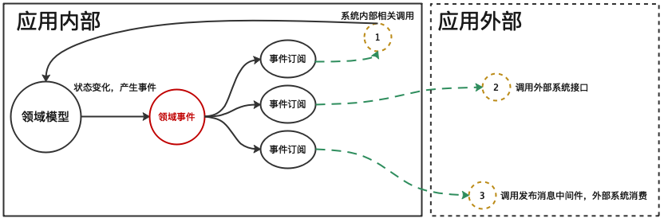

# 基于RocketMQ实现的领域事件发布订阅能力

## 功能介绍

基于RocketMQ的领域事件发布订阅组件，充分借助了RocketMQ可靠性能力、消息持久化能力、消息回溯能力以及分布式处理能力。同时，便于问题的排查。该组件规避了使用线程池方式领域事件发布订阅能力缺陷。该组件实现了IDomainEventManager接口，可以无缝的在基于线程池发布订阅组件和基于RocketMQ发布订阅之间切换使用，并且发布和订阅的相关业务代码无需修改。

> 领域事件、以及发布订阅的能力，属于一个应用内部的运行逻辑，用于领域事件的topic,一般情况下不应该被外部系统消费。如果，外部应用需要接受一个消息来触发相关的操作，那么可以单独创建一个供外部系统使用的topic,系统内部相关的领域事件，可以增加一个领域事件订阅，用于发送供外部系统使用的消息。
>


## 版本说明

* RocketMQ版本：4.7.1
* JAVA：1.8

# Maven

编辑您的pom.xml文件

```xml

<profiles>
    <profile>
        <id>coding</id>
        <repositories>
            <repository>
                <id>leebmw-easy-snapshoot</id>
                <name>snapshoot</name>
                <url>https://leebmw-maven.pkg.coding.net/repository/easy/snapshoot/</url>
                <releases>
                    <enabled>true</enabled>
                </releases>
                <snapshots>
                    <enabled>true</enabled>
                </snapshots>
            </repository>
        </repositories>
    </profile>
</profiles>
```
编辑您的 pom.xml 文件

```xml

<dependency>
    <groupId>easy-domain</groupId>
    <artifactId>easy-domainevent-rocketmq</artifactId>
    <version>1.0</version>
</dependency>
```

## 使用方法

1. 应用服务层服务类的父类构造函数接受一个IDomainEventManager接口实现，RocketMQ领域事件发布订阅组件实现了该接口。无参数的构造函数默认使用基于线程池的组件。以下代码 1 、2处

```java
public abstract class BaseApplication implements IApplication {

    private final IDomainEventManager manager;

    /**
     * 1
     * 使用默认 事件处理器的构造函数
     */
    protected BaseApplication() {
        this.manager = new ThreadPoolTaskDomainEventManager();
    }

    /**
     * 2
     * 带事件处理器的构造函数
     *
     * @param manager 事件处理器
     */
    protected BaseApplication(IDomainEventManager manager) {
        this.manager = manager;
    }
    ....无关代码省略
}
```

2.
使用RocketMQ领域事件发布订阅组件需要实例化RocketMqDomainEventManager类。该类接受三个参数分别是IProducerCreator、IConsumerCreator、environmentName。以下代码 1
处

```java
public class RocketMqDomainEventManager implements IDomainEventManager, MessageListenerConcurrently {
    //1
    public RocketMqDomainEventManager(IProducerCreator producerCreator, IConsumerCreator consumerCreator, String environmentName) {
        this.mqProducer = producerCreator.create();
        this.consumer = consumerCreator.create();
        this.environmentName = (environmentName == null || environmentName.equals("")) ? "prod" : environmentName;

        this.initConsumer();
    }
       ....无关代码省略
}
```

* IProducerCreator接口用于创建RocketMQ的生产者实例，ProducerCreator类是默认的实现类。可以根据具体的情况重新实现IProducerCreator接口，以满足特定的环境。
* IConsumerCreator接口用于创建RocketMQ的消费者实例，ConsumerCreator类是默认的实现类。可以根据具体的情况重新实现IConsumerCreator接口，以满足特定的环境。
* environmentName参数，用于实现消息的环境隔离（如，生产环境和灰度环境的消息隔离），当使用该参数是，RocketMQ的topic名字由 environmentName_<事件名称> 组成。

3.事件的注册需要调用registerDomainEvent方法。见代码1处。

```java
private void initSubscriber(){
        // 1
        this.registerDomainEvent(MyDomainEvent.class);

        this.registerSubscriber(factory.build(MyDomainEvent.class,s->{
        this.countDownLatch.countDown();

        System.out.println("执行相应的操作");

        }),"test1");
        }
```

4. 事件的订阅可以使用RocketmqSubscriberFactory类来创建，该类实现了ISubscriberFactory接口

```java
        RocketmqSubscriberFactory factory=new RocketmqSubscriberFactory();
        this.registerSubscriber(factory.build(MyDomainEvent.class,s->{
        this.countDownLatch.countDown();
        System.out.println("执行相应的操作");
        }),"test1");

```

5. 定义领域事件类

```java

@EventName(value = "ShareDomainEvent", shareTopicName = "SharedTopic")
public class ShareDomainEvent extends BaseDomainEvent {
   ...省略无关代码
}
```

* @EventName注解 是可选项，如果不设置，需要在RocketMQ中创建和类名一样的Topic,如："ShareDomainEvent"
* 指定@EventName注解，value值必须设置，设置value后，value的值是RocketMQ对应的Topic。
* shareTopicName 是可选项，该值用于多个事件共用一个RocketMQ的Topic,可以在多个领域事件类中指定相同shareTopicName值。
* 领域事件是一个业务上的概念，它是由领域实体状态变化产生的，对领域事件的命名上应更多的体现业务含义。领域事件和领域实体紧密相连，领域事件类应和领域实体类放在相同模块或包里。
